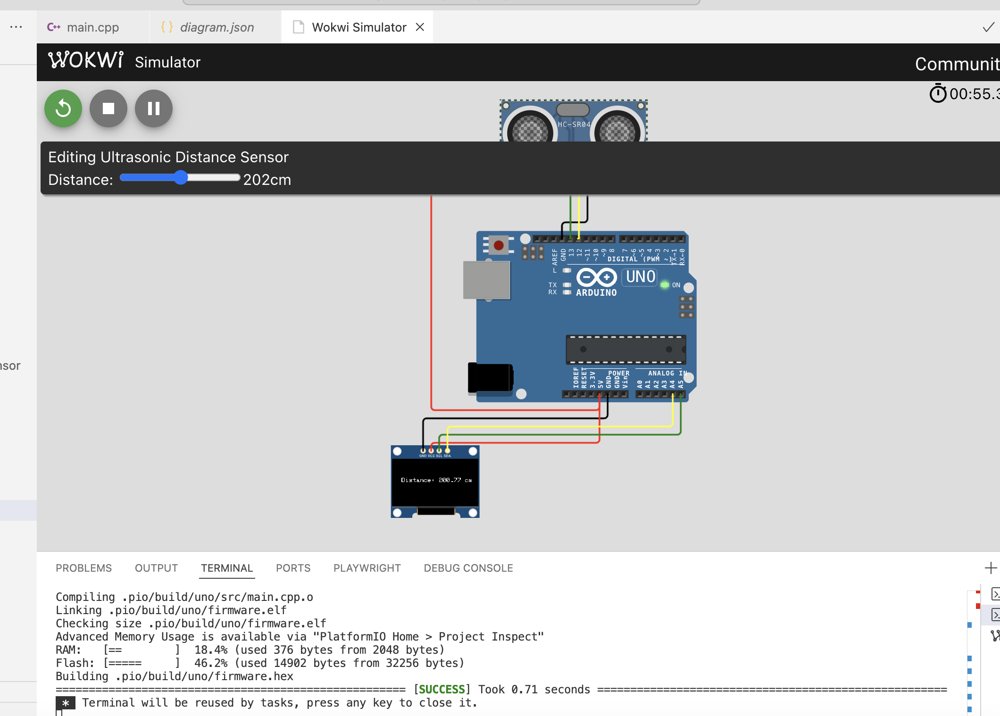

# Ultrasonic-Distance-Sensor

     
## Overview
The project demonstrates effective integration of sensor input and graphical output, providing a foundation for IoT applications, robotics distance sensing, or industrial monitoring systems. The code is optimized for reliability and can be easily extended with additional features.

**Important Note:** 
Please note that the measured values may not be 100% accurate as this project was developed in a simulator environment. 

## Used Technologie

- Basic Arduino Uno configuration with PlatformIO
- Arduino framework 
- I2C Protocol
- monochrome 128x64 OLED display 

## Prerequisites

- [Visual Studio Code](https://code.visualstudio.com/)
- [PlatformIO IDE](https://platformio.org/install/ide?install=vscode)
- Arduino Uno board
- Wokwi License (community)
- Basic knowledge of C++ programming
  
## Icons
  * https://www.flaticon.com/free-icon/sensor_2540167?term=sensor&page=1&position=29&origin=search&related_id=2540167
